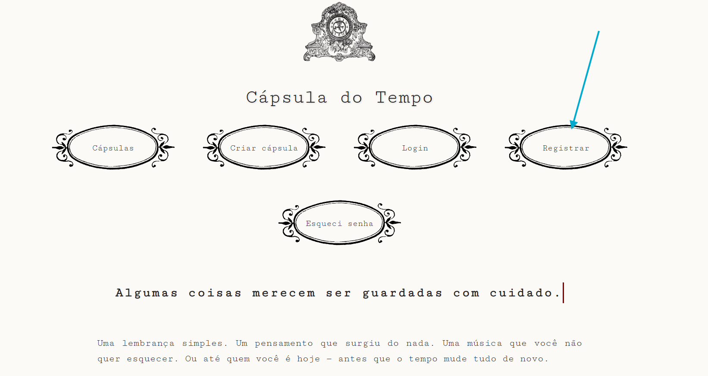
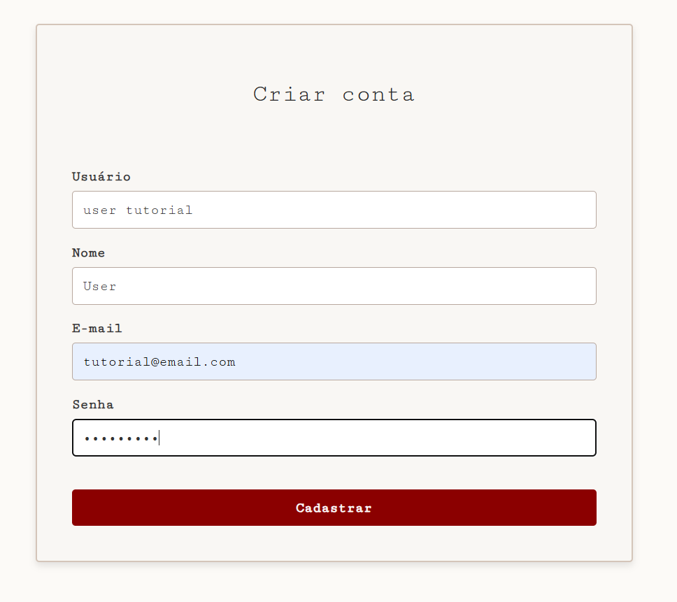
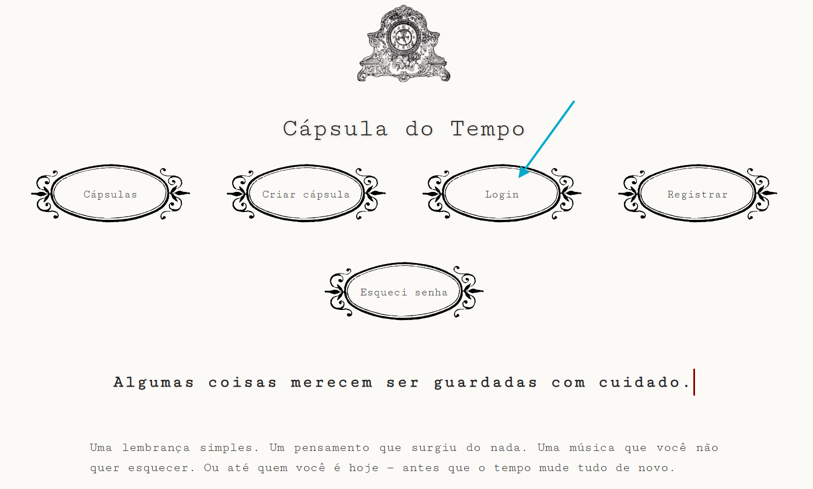
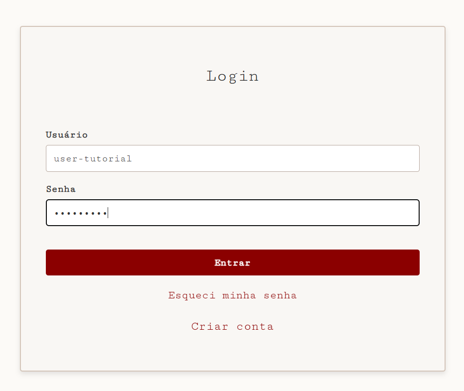
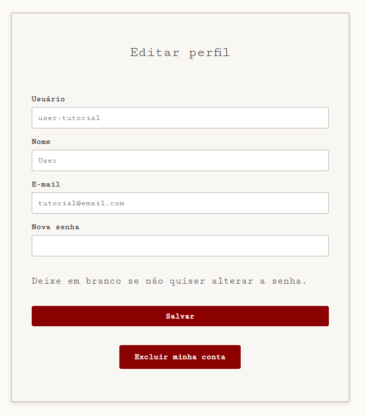
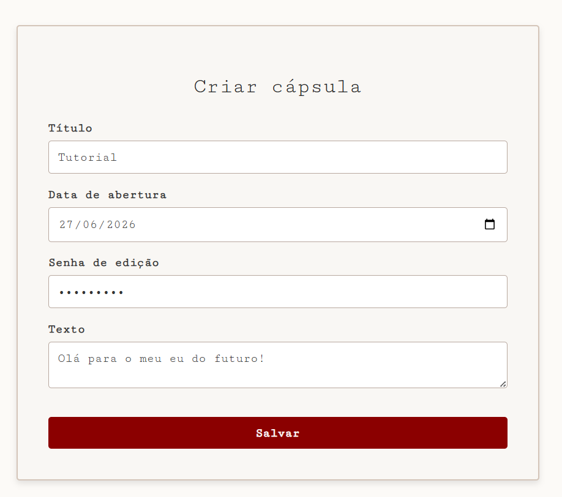
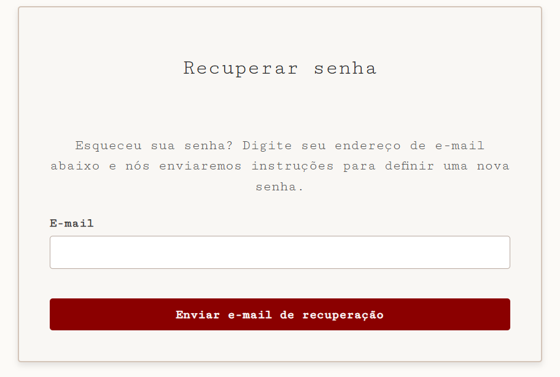
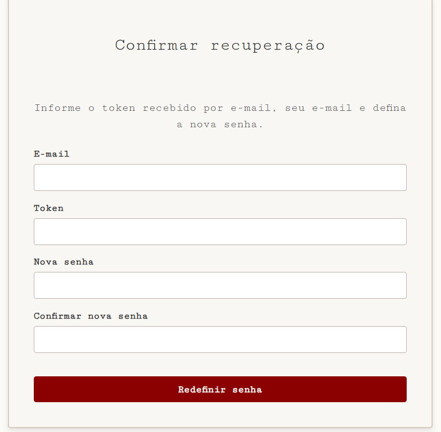

# INF1407 - Capsula do Tempo (Frontend)
Este projeto é uma aplicação web desenvolvida para a disciplina de Programação para a Web na PUC-Rio. A plataforma permite que utilizadores criem "cápsulas digitais" com mensagens e conteúdos que só poderão ser abertos em datas futuras específicas.

## Grupo
* **Julia Gomes Zibordi** 
* **Marcos Paulo Marinho Vieira**

---

## Escopo do projeto
A **Cápsula do Tempo** foi concebida como uma ferramenta de preservação de memórias digitais. O foco principal do desenvolvimento foi criar uma interface autêntica, simulando o envio de envelopes físicos.

**O que foi desenvolvido no frontent:**
- Interface em HTML, CSS e TypeScript que permite criação e gerenciamento de cápsulas e usuários através de requisições ao backend.
- Deploy do frontend.

Tudo o que foi desenvolvido está funcionando. 

## Instruções de uso

### 1. Acesso via site
Para testar o site, acesse o link:
👉 **()**

### 2. Execução em ambiente local
Caso deseje rodar o site em sua máquina, certifique-se de que tem o Python e o Node.js instalados e siga os passos a seguir. 

```bash
# 1. Clonar o repositório do backend
git clone https://github.com/MarcosVieira71/INF1407---Capsula-do-Tempo-backend.git

# 2. Instalar dependências necessárias
pip install -r requirements.txt

# 3. Aplicar as migrações do banco de dados
python manage.py migrate

# 4. Iniciar o servidor local
python manage.py runserver

# 5. Clonar o repositório do frontend
git clone https://github.com/juliazib/INF1407---Capsula-do-Tempo-frontend.git

# 6. Fazer as instalações necessárias
npm install

# 7. Fazer o build da aplicação
npm run build

# 8. Iniciar a aplicação
python3 -m http.server 3000

````

## Guia de Funcionalidades (Passo a Passo)

### 1. Primeiro acesso e registro
Ao acessar o site, há uma página inicial com as opções "Cápsulas", "Criar cápsula", "Login", "Registrar" e "Esqueci senha". Além disso, há uma breve explicação sobre o conceito das cápsulas do tempo. Para criar o seu usuário, escolha a opção "Registrar".



Preencha todos os campos do formulário e clique em "Cadastrar".



Se os campos tiverem sido preenchidos corretamente, você receberá uma mensagem de sucesso. Caso contrário, corrija os campos que estiverem indicados com erro no formulário. 

### 2. Login

A opção de login pode ser acessada através da página inicial clicando em "Login".



Preencha o formulário com o username e a senha que você criou ao se registrar no site. Caso tenha esquecido a sua senha, veja a seção 6 (Recuperação de senha).



### 3. Edição do perfil
Para editar seu perfil, clique em "Olá, [seu username] ou na imagem da moldura no topo direito do site.

<div align="center">

</div>

Altere as informações que desejar por meio do formulário e clique em "Salvar".



### 4. Criação de cápsulas do tempo
Para criar uma cápsula do tempo, você precisa estar logado. Para mais informações sobre registro e login, veja as seções 1 (Primeiro acesso e registro) e 2 (Login). Quando estiver pronto, clique em "Criar cápsula".

<div align="center">

</div>

Preencha a sua cápsula com título, data de abertura e um texto para o seu futuro eu. Além disso, crie uma senha para a sua cápsula. Caso deseje editá-la, será necessário inserir essa senha. 



Assim que você criar uma cápsula, ela ficará salva no seu perfil. Para ver todas as suas cápsulas criadas, basta clicar em "Cápsulas". 

imagem da cápsula

### 5. Edição de cápsulas do tempo
Para editar uma cápsula do tempo, clique em "Editar". É necessário inserir a senha que você definiu no momento da criação. 

imagem da edição

Quando estiver satisfeito com as suas mudanças, clique em "Salvar".

⚠️ Não é possível editar cápsulas após a sua data de abertura.

### 6. Recuperação de senha
A recuperação de senha ocorre através do envio de um e-mail pelo terminal. Nesse e-mail, há um link que leva a uma página onde o usuário pode inserir sua nova senha. Como a recuperação é feita pelo terminal, não está disponível pelo site, mas pode ser testada localmente. Para isso, clique em "Esqueci senha".

<div align="center">

</div>

Digite o e-mail relacionado à sua conta.



Clique no link da página de confirmação e insira seu e-mail, o token enviado, sua senha antiga e a nova senha.



Clique em "Redefinir senha" e pronto.

## Sobre a abertura e a edição das cápsulas do tempo
Ao criar uma cápsula, ela permanecerá selada até a sua data de abertura. Portanto, não será possível visualizar o conteúdo de uma cápsula imediatamente após a sua criação. No entanto, é possível editar o conteúdo por meio de uma senha, definida no momento da criação. Para mais informações sobre isso, veja as seções 4 (Criação de cápsulas do tempo) e 5 (Edição de cápsulas do tempo). Assim que passar a data de abertura de uma cápsula, seu conteúdo poderá ser aberto e ficará disponível para ser visualizado sempre que desejar, mas não poderá mais ser editado. 


---


 
